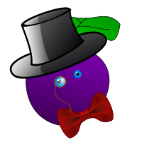

# a-posh-plum

A lightweight application shell giving clean, consistent UI to React apps.



Your app is destined for greatness.  A Posh Plum makes it all easier.

## Why?

React makes it easy to control the fine details of a web page. 
You're in control, but you're left having to make all the choices 
(and components) yourself.

A Posh Plum makes it all easier.  Its components provide a responsive web app
that "just works" on mobile or desktop browsers, with menu and page-layout
components and stylesheets based on Spectre.css.  

Plum provides React components ready to use for presenting a material-like UI, 
with your application's objects presented as cards that open incrementally 
and are easy to augment with icons, status indicators and more.  You get to 
think at a higher level and concentrate on your results.

## Quick start:

!!! WARNING - under construction - docs first.  We'll remove this warning once
things are working as described. !!!

Getting started is easy:

`> yarn add a-posh-plum`

```
// normal routing with React-router -
<Route exact path="/" component={Home} />
<Route path="/hello" component={Hello} />

// in component files:
import {Card} from 'a-posh-plum/cards';

@MyLayout  // -- gives the layout to your home page
class Home extends Component {
  render() { 
    return <div>
      <h1>My Posh app</h1>
      
      <p>This app lets you manage all of your widgets 
        and share them with your friends, ...
      </p> 
    </div>
  }
}
@MyLayout  // -- gives the layout to your Hello page
class Hello extends Component {
  render() { 
    return <div>
      <h1>Hello World</h1>
      <Card>
        <Card.Title>My first Card</Card.Title>
        <Card.Body>Check it out!</Card.Body>
      </Card>
    </div>
  }
}

// -- in MyLayout.jsx:
import {withMenuBar} from 'a-posh-plum/layouts';
import {NavLink} from 'react-router-dom';

@withMenuBar // mixes your menu with Plum's built-in layout template
class MyLayout extends Component {
  render() { // renders menu items for the layout
    return [ 
      <NavLink to="/">Home</NavLink>,
      <NavLink to="/hello">Members</NavLink>,
    ]
  }
}
```

## Anatomy of a Plum-based app

Apps built with Plum are based on a mental model you already know: pages, 
layouts and cards.  Plum's UI components give you a refined presentation 
that's easy to apply.

Layouts provide consistency across various pages of your app. 
You can make your own layouts (see more below) or use Plum's built-in
layouts for responsive apps:    

 * withMenuBar: A simple layout with a standard horizontal menu bar and 
   page-body area.  Use a single menu for your entire app, or choose dynamic 
   menu content that changes with the current page.
   
 * withMenuPanel: Another simple layout with a standard vertical menu area 
   on the left (hidden by default on small screens).
   
 * withPanel: A fancier layout, with a floating panel that opens to reveal 
   details on top of an existing screen, without disturbing the contextual 
   content.
   
Plum's layout components are easy to mix together with your application's 
pages and customize for great reusability. 

To add a page to your app, you simply create a react component that uses a 
layout.  Add the pages into your top-level routing config, and *poof* your 
app's presentation comes together as an integrated unit, with consistency 
baked right in.

  > _He put in his thumb,_  
  > _And pulled out a plum,_  
  > _And said, "what a good boy am I!"_

  -- [Mother Goose](https://www.poetryfoundation.org/poems/46973/little-jack-horner-56d2271c5917a)


## Getting Posh

### Using Plum's material UI

Plum's UI components provide you with a declarative way to make a pixel-perfect
UI that appears to be made with material like paper or or cardboard.  You can
place your application's conceptual objects into Plum's UI components, making them
tangible to your app's users.  This gives you a simple tap-based interface that
people understand intuitively.

#### Card

```
import {Card} from 'a-posh-plum/cards'
  ...
  render() {
    <Card>
      <Card.Icon icon="icon-check"/>
      <Card.Title>My Thing</Card.Title>
      <Card.StateTag>Ready</Card.StateTag>
      <Card.Body>
        Awesome Item
      </Card.Body>
      <Card.Route path="/items/:id">
        Expanding content when the card is tapped
      </Card.Route>
    </Card>
  }
```

The Card subcomponents like `<Card.Title>` are easily auto-completed from your
Javascript-aware editor, so you can fluently build out your app, one 
auto-completed element at a time.

There's also a `<CardList>` component that takes a collection of items to render
as cards - see its docs for usage.

#### Panel

The Panel component gives an overlay treatment that responds to small or large
screens, displaying both primary content and (if the screen is big enough) 
background material.  

There's a layout form of the panel component, or you
can use the Panel directly (notice how the sub-components have the same form as 
the Card subcomponents above):

```
import {Panel} from 'a-posh-plum/cards'

<Panel>
  <Panel.Icon src="/bow-tie.png" />
  <Panel.Title>A sweet editing panel</Panel.Title>
  <Panel.StateTag tag="Posh!" />
  <Panel.Body><form> 
      ...some form elements
    </form>
  </Panel.Body>
</Panel>
```

The Panel can be used like this, but you're more likely to use it as a layout instead...

#### The `withPanel` layout

The "withPanel" layout provides a layered presentation with background content 
(provided by an existing page and route) plus an overlaid panel having more 
specific content, which you define with an _*additional*_ page and route.  

```
// in your routes setup:
<Route path="/things" component={ThingList} />
<Route path="/things/:id/edit" component={ThingEditor} />

// A page-level component:
import {withPanel} from 'a-posh-plum/layouts'
import {Panel} from 'a-posh-plum/cards'

@withPanel class ThingEditor extends Component {
  render() {
    <Panel.Icon src="/bow-tie.png" />
    <Panel.Title>{this.state.title}</Panel>

    ... some form elements ...
  }
}  
```

As you can see, this makes your page component into a panel, and you can use
the Panel's subcomponents to render an icon, title, and so on (this example
also shows the "default body" feature, which extracts content to a default
Body section, saving a little typing).

The two routes shown in this example both match the editing URL (one is more 
specific, but they both match); both pages are rendered, so the ThingList is 
displayed (if the screen is big enough) behind the panel. 

On smaller screens, the ThingEditor will be fullscreen and scrollable,
hiding the ThingList instead.  See the docs for the Panel component to learn 
more about making it responsive to small screens.
 
#### Custom Layouts

Plum's cards and layouts are created with just a couple of simple utilities, which 
you can use yourself to make layouts of your own.

```
import {namedSlot, Layout} from 'a-posh-plum/util`;

class MyLayout extends Layout {
  static displayName = "MyLayout"
  static Title = namedSlot(displayName, "Title");
  static Sidebar = namedSlot(displayName, "Sidebar");
  render() {
    let slots = this.extractSlots()
    // ... your html markup for this layout...
    return <div>
       <h1 className="title">{slots.Title}</h1> 
          
       <div className="sidebar">{slots.Sidebar}</div>
       <div className="body">{slots.other}{slots.body}</div>
     </div>
  }
}
```

This example doesn't specify styling for these items; when you make a layout,
you can control exactly the HTML and styles you want.  

You might think of a layout as an 
envelope for page-level content; in the layout component above, you can configure
exactly the layout of the envelope, and when you insert pages into the 
envelope, the page content shows through the envelope sections ("slots").

To use the layout for your pages:

```
@MyLayout class Page1 extends Component {
  render() { return <div>
    <MyLayout.Title>Page 1</MyLayout.Title>

    Check out my sweet page.
    
    <MyLayout.Sidebar>
      
    </MyLayout.Sidebar>
  </div>
  }
}

@MyLayout class Page2 extends Component {
  render() { return <div>
    <MyLayout.Title>Page 2</MyLayout.Title>

    This page is chock full of awesome.
    
    <MyLayout.Sidebar>
      
      
      
    </MyLayout.Sidebar>
  </div>
  }
}
```