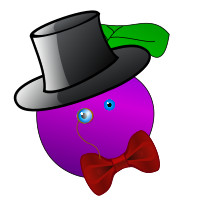
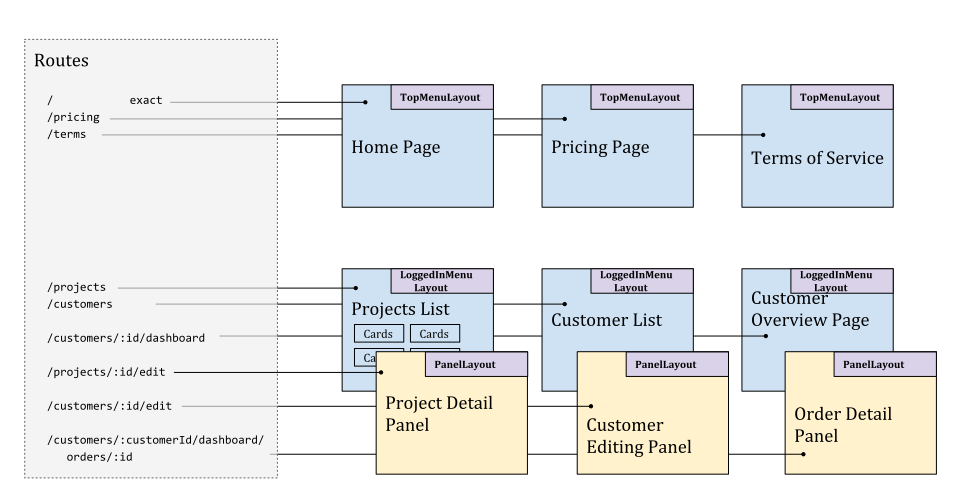
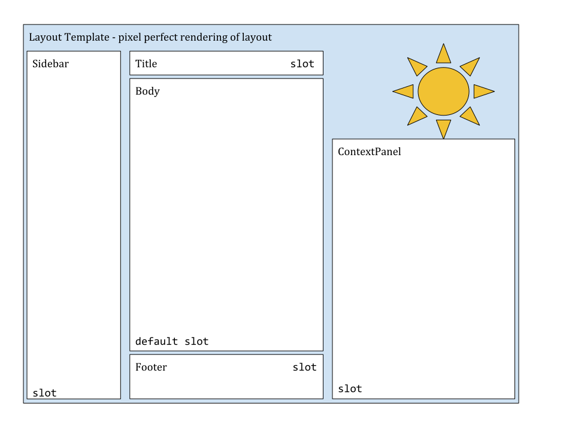

# Posh Plum

A lightweight application shell giving clean, consistent UI to React apps.



Your app is destined for greatness.  A Posh Plum makes it all easier.

## Why?

React lets you control the fine details of a web page. 
You're in control, but you're left having to make all the choices 
(and components) yourself.

Posh Plum's components provide a responsive web app
that "just works" on mobile or desktop browsers, with menu and page-layout
components and stylesheets based on Spectre.css.  

Plum provides React components ready to use for presenting a material-like UI, 
with your application's objects presented as cards that open incrementally 
and are easy to augment with icons, status indicators and more.  You get to 
think at a higher level and concentrate on your results.

## Quick start:

WARNING - under construction - docs first.  This package is still pre-release.

Getting started is easy:

`$ yarn add poshplum`

```
// import global CSS rules if you want to use Plum's
//   styles based on Spectre.css.  
import "poshplum/plum.css"

// normal routing with React-router -
<Route exact path="/" component={Home} />
<Route path="/hello" component={Hello} />

// in component files:
import {Card} from 'poshplum/cards';
import {TopMenuLayout} from 'poshplum/layouts';

class Home extends Component {
  render() {
    let {MoreMenuItems,Title} = TopMenuLayout.slots;
    
    return <TopMenuLayout>
      <Title>My Posh app</Title>
      <Menu>
        <Link to="/pricing">Pricing</Link>
        <Link to="/terms">Terms of Service</Link>
      </Menu>
      
      <p>This app lets you manage all of your widgets 
        and share them with your friends, ...
      </p> 
    </TopMenuLayout>
  }
}
class Hello extends Component {
  render() { 
    let {partId} = ... // get from route
    let {Menu,Title} = TopMenuLayout;
    return <SideMenuLayout>
      <Title>Hello World</Title>
      <Menu>
        <Link to={`/service/part/{partId}`}>Finding Service</Link>
        <Link to="/terms">Terms of Service</Link>
      </Menu>
      
      <Card>
        <Card.Title>My first Card</Card.Title>
        
        <Card.Body>
          Check out these electronic parts...
        </Card.Body>
      </Card>
    </div>
  }
}
```

## Anatomy of a Plum-based app

Apps built with Plum are based on a mental model you already know: routes, 
pages, layouts and cards.  Plum's UI components give you a refined presentation 
that's easy to apply.



Routes map from URLs to pages.  Each page is presented with a layout, and layouts 
are shareable.  Layouts provide consistency and reusability across various pages 
of your app.  They contain named slots, and they package the "render props" 
pattern in a way that inverts control and simplifies syntax.
 
You can make your own layouts (see more below) or use Plum's built-in
layouts for responsive apps:    

 * `<TopMenuBar>`: A simple layout with a standard horizontal menu bar and 
   page-body area.  Use a single menu for your entire app, or choose dynamic 
   menu content that changes with the current page.
   
 * `<LeftMenuBar>`: Another simple layout with a standard vertical menu area 
   on the left (hidden by default on small screens).
   
 * `<Panel>`: A fancier-looking layout that shows extra content or other 
  UI in a floating panel, partially obstructing the background material while
  maintaining the background for the user's mental context.  

Plum's layout components are easy to mix together with your application's 
pages and customize for great reusability. 

To add a page to your app, you simply create a react component, decorated with
a chosen layout.  Its `render()` method declares the content to be inserted into 
the layout.

```
let {Title,Body} = TopMenuBar;
class MyPage {
  render() {
    return <TopMenuBar>
       <Title>My Fine Page</Title>
       <Body>
         <p>this is some body content on my page.  Any HTML I like goes here.</p>
       </Body>
    </TopMenuBar>
  }
}
```

Add the pages into your routing config, and *poof* your 
app's presentation comes together as an integrated unit, with consistency 
baked right in.

  > _He put in his thumb,_  
  > _And pulled out a plum,_  
  > _And said, "what a good boy am I!"_
-- [Mother Goose](https://www.poetryfoundation.org/poems/46973/little-jack-horner-56d2271c5917a)

## Bundle size

Plum takes less than 3kB, compressed, for `import poshplum/layout`, letting you create
your own layouts.  Adding the material UI in Cards and Panel bring the total to less
than 7kB compressed javascript and about 13kB of compressed CSS.

Reactor and State machine add less than 10kB compressed javascript, bringing the grand total
to right at 30kB, if you use all the things.

## Extra Posh

### Blended layout slots 

Need to group a dozen different pages, each sharing a section-level menu?
Plum's `<Layout>`s are easy to compose, thanks to React - this lets you blend
together layout slots for easy reusability.

```
  // -- in MyLayout.jsx:
  import {SideMenuLayout} from 'poshplum/layouts';
  import {NavLink} from 'react-router-dom';

  // reusable section of an app
  class PartsSection extends Component {
    render() {
    let {children} = props;
    let {Menu,Title} = SideMenuLayout;
    return <SideMenuLayout>
      <Menu>
         ... 9 items in shared menu...
      </Menu>
      
      {children}          {/* seamlessly blending Titles from children */}
                          </*   ...or additional MoreMenuItems */}
    </SideMenuLayout>
  } 
}

// reusing the Parts section:
class PartsInstallation extends Component {
  render() { // renders menu items for the layout
    let {Title} = SideMenuLayout;
    return <PartsSection>
      <Title>Parts Installation</Title>
      
      <h2>At our offices</h2>
      ....
      <h2>At your site</h2>
      ...
    </PartsSection>
  }
}

class PartsFinding extends Component {
  render() { // renders menu items for the layout
    let {Title} = SideMenuLayout;
    return <PartsSection>
      <Title>Finding the right parts for your stuff</Title>
      <Menu>
         More menu items
      </Menu>
      
      <h2>By manufacturer</h2>
      ....
      <h2>By model number</h2>
      ...
    </PartsSection>
  }
}
```

In the `<PartsFinding>` component, "More menu items" will be included after 
the 9 menu items from the `<PartsSection>`. 

### Using Plum's material UI

Plum's UI components provide you with a declarative way to make a pixel-perfect
UI that appears to be made with material like paper or cardstock.  You can
place your application's conceptual objects into Plum's UI components, making them
tangible to your app's users.  This gives your app a simple touch-ready interface 
that people understand intuitively.

Be sure to configure webpack with e.g. MiniCssExtractPlugin and HtmlWebpackPlugin, 
to include the styles in your project's output files.  `import "poshplum/plum.css"` 
from your app's entrypoint, and the plugins should bundle and insert the styles
in the the page.

If you want to customize the Spectre.css SCSS defaults and compile the scss in 
your own project's build, we'll gladly take a PR and/or a sponsor for exposing the 
bundled plum-defaults.scss + spectre's .scss as an output from the Rollup build.  


#### Card

```
import {Card} from 'poshplum/cards'
MyCard = () => <Card>
    <Card.Icon icon="icon-check"/>
    <Card.Title>My thing in a posh Card   </Card.Title>
    <Card.Label>
      Ready
    </Card.Label>
    <Card.Body>
      Awesome Item
    </Card.Body>
    
    <Card.Route path="/items/:id">
      Expanding content when the card is tapped
    </Card.Route>
</Card>
```

The Card subcomponents like `<Card.Label>` are easily auto-completed from your
Javascript-aware editor (IDEA, VSCode), so you can fluently build out your app, one 
auto-completed element at a time.

There's also a `<CardList>` component that takes a collection of items to render
as cards - see its docs for usage.

#### Panel

The Panel component gives an overlay treatment for nested
screens/workflows, such as a master/detail pattern; it responds 
to small or large screens, and helps manage user-attention 
concerns. 

For example, let's say the user is 
viewing a Client summary screen, and they can click one of the 
customer's orders.  To minimize attention churn, we can keep 
the Client Summary screen being displayed as-is, and overlay a  
Panel to show the details of the order - only until the user closes 
it.

```
// in your routes setup (top-level app component):
<Route path="/things" component={ThingList} />
<Route path="/things/:id/edit" component={ThingEditor} />
```

Both routes can match, and both things can be rendered; this helps 
people maintain a conceptual anchor to their location (the Client 
summary screen); viewing an order doesn't change the person's 
notion of "where they are".   

On small screens, the nested workflow is shown in full-screen style; 
a Back button is expected in the upper-left.

```
import {Panel} from 'poshplum/layouts'

class ThingEditor extends Component {
  render() { return <Panel>
    <Panel.Icon src="/bow-tie.png" />
    <Panel.Title>{this.state.title}</Panel>

    ... some form elements ...
  </Panel>
  }
}
```

#### Custom Layouts

Plum's cards and layouts are created with just a couple of simple utilities, which 
you can use to make layouts of your own creation.  Note the use of defaultSlot for 
the Body section.

```
import {namedSlot, Layout} from 'poshplum/util`;

let Title = Layout.namedSlot("Title");
let Sidebar = Layout.namedSlot("Sidebar");
let Body = Layout.defaultSlot("Body");

class MyLayout extends Layout {
  static Title = Title;
  static Sidebar = Sidebar;
  static slots={Title,Sidebar,Body}
  render() {
    let slots = this.slots;
    
    // ... your html markup for this layout...
    return <div>
       <h1 className="title">{slots.Title}</h1> 
          
       <div className="sidebar">{slots.Sidebar}</div>
       <div className="body">
          {slots.Body}
       </div>
     </div>
  }
}
```

This example doesn't specify much styling, but when you make a layout, you can 
control exactly the HTML and styles you want.  

You might think of a layout as an envelope for page-level content; in the layout 
component above, you can configure exactly the layout of the envelope, and when 
you insert pages into the envelope, the page content shows through the envelope 
sections ("slots"). 

You can make as many slots as needed for your layout.  Here's a layout that includes
a right-side `<ContextPanel>` area, which can be controlled by your page-level 
components. 



The layout component can re-order the slot content, and place them exactly where they 
need to achieve its presentation goals.   

```
class Page1 extends Component {
  render() { return <MyLayout>
    <MyLayout.Title>Page 1</MyLayout.Title>

    Check out my sweet page.
    
    <MyLayout.Sidebar>
      
    </MyLayout.Sidebar>
  </MyLayout>
  }
}

class Page2 extends Component {
  render() { return <MyLayout>
    <MyLayout.Title>AWESOME PAGE!!!</MyLayout.Title>

    This page is chock full of awesome.
    Unmatched children go to the defaultSlot.
    
    <MyLayout.Sidebar>
      
      
      
    </MyLayout.Sidebar>
  </MyLayout>
  }
}
```

## Application Plumbing

Posh Plum also provides two optional components to use as the plumbing for
high-reliability application software.  With Reactor and State Machine, it's
possible to create any application from simple to sophisticated without any
other libraries.

### State Machines

The Finite State Machine might sound stodgy and mathematical, but we think it's 
one of the most useful inventions ever to be created.  Some form or
other of a state machine is used for essentially every high-reliability 
technology in existence.  Consider the light-switch, the elevator or the jumbo 
jet: having a clear, reliable map of all their possible states can be key to 
predictability.

Plum offers declarative `<State>`s and `transitions` to implement the core of
FSM's for UI.  In this example, we show a card that expands on click and opens a 
route when double-clicked:

```
import withStateMachine, {State} from "poshplum/withStateMachine";
import Cards from "poshplum/Cards"
import {Route, Link, withRouter} from "react-router-dom";

@withRouter
@withStateMachine 
MyCard extends React.Component {
  constructor() { this.openRoute = this.openRoute.bind(this) }
  openRoute() {
    const {history} = this.props;
    history.push('/some/nested/route');
  }
  render() {
    const editing = [this.openRoute, "editing"];
    
    return <div>
      <State name="default" transitions={{"expand": "expanded", "click": "expanded"}} />
      <State name="expanded" transitions={{"dblclick": editing, "edit": editing}} />
      <State name="editing" transitions={{"back": "default"}} />
      <Cards.Card>
        <Cards.Title>Imaginary Project</Title>
        
        {this.hasState("expanded") && <p>Expanded card with a project summary</p>
        <Cards.Footer>
          4 people are working on this project
          {this.hasState("expanded") && <p>Double-click to <Link 
            onClick={this.mkTransition("edit")} to="/some/nested/route">edit</Link></p>}
        </Cards.Footer>
      </Cards.Card>
      <Route path="/some/nested/route" component={EditingPanel} />
    </div>
  }
}
// EditingPanel class: implementation not shown
```

The `<State>` components declare all the states that the component can have. Your 
state machine doesn't have to stop at 3 actions.  If you can draw a flowchart on 
a whiteboard, you can make a state machine directly from that diagram using Plum's 
`<State>` component.  

We suggest using imperative-looking command words (click, close, cancel, open, 
search) for transition names, and descriptive `-ing` or `-ed` words for state names 
(opened, searching, closed, waiting, selectingOption).  

The transitions declared in each `<State>` indicate actions (`expand`, `click`, 
`dblclick`, `back`, ...) that will lead to other states (`expanded`, `editing`, 
`default`, ...).  In the example, `const editing` shows how to use a predicate 
function, which can disallow a state transition (return `false`) and/or provide 
side effects if the transition is allowed.

The `<EditingPanel>` in this example might trigger a `back` transition using 
`dispatchEvent` or `Reactor.trigger()`, and the state machine will catch and act 
on these events found within its DOM tree.  You can trigger the same events from 
anywhere, making it easy to create a site tour that can expand a card or even 
open the editor as the visitor clicks "Next".  Or you could enhance a list of
cards with behavior that keeps at most one card `expanded`.  

### Reactor

The Reactor module provides a handful of components that can work fluidly together
to compose rich application functionality from declarative components, while keeping
coupling low.  It takes advantage of the browser's highly performant event 
infrastructure, while proactively managing event listeners to avoid memory leaks.

Reactor current expects a DOM environment.  React-Native isn't expected to work, 
although it may be possible to shift to using synthetic events in the virtual DOM.  
Patches welcome.

#### Reactor: State machine example
The State Machine example above does internally create a Reactor similar to the 
following, translating the `transition=` entries to `<Action>`s.

```
  @Reactor 
  class wFSM$MyCard {
    render() {
      return <div>
        {this.hasState("default") && <Action expand={this.mkTransition("expand")} />}
        {this.hasState("default") && <Action click={this.mkTransition("click")} />}
        {this.hasState("expanded") && <Action dblclick={this.mkTransition("dblclick")} />}
        {this.hasState("expanded") && <Action edit={this.mkTransition("edit")} />}
        {this.hasState("editing") && <Action back={this.mkTransition("back")} />}
      </div>
    }
  }
```

In the case of the State machine, the Actions available at a moment are
depending on the current state of the machine.  You could use 
`this.setState({currentState})` to force a different state machine change, 
but we hope you don't need to do that.  `transition()`, `mkTransition()` and 
`trigger()` should be sufficient.

#### Actors and Actions

The purpose of the Reactor is to provide an explicit scope for Actors and Actions,
and to mediate access to those Actions for UI components.  The `@Reactor` 
declaration provides an event-listening scope, implementing the classic "event 
delegate" pattern on behalf of every `<Action>` it sees.  

If you're used to Redux actions, you may already have a correct intuition on 
these actions. Dispatching actions can be as simple as issuing 
`this.trigger("eventName", {...payload})`.  There's no implicit connection 
to a global store: Reactors can use `setState()` within their own scope, or 
they can use other techniques that work for you.  An unhandled event will always
raise an error for your attention; we don't tolerate mysteries.

The @Actor decorator supports lightweight declaration of a separate, named, 
reusable module of actions, plugging into an existing Reactor found in your 
application.  The Reactor acts as a listening delegate for `actorName:actionName` 
events.  

An Actor can contribute to their Reactor's `state`, or they can share 
asyncronous events in the Reactor's scope, without any implicit state changes.


#### Custom Events: Publish and Subscribe within a Reactor

Keyboard and mouse activities from a user are found in DOM events.  At a higher
level of abstraction, the browser detects focus changes and animation progress, 
and exposes events about them to interested listeners.  

A Posh Plum makes it easy for actors to reveal higher-level application semantic 
activities as events, for the places where Things can Happen.  Example use-cases
could include:

 * Right-click + WASD => paginate vertically/horizontally within
   a section of the page
 * Side-button + R = `<Publish event="wantsRefresh" />`, with a form that
   `<Subscribe>`s and reacts to that request.  
 * Alt, held for more than 0.5s => reveal keyboard shortcuts next to every 
   onscreen control
 * A data-loading Actor monitors for changes on the record it loaded, 
   and the related Form keeps the form syncronized.

The `<Publish>` and `<Subscribe>` components make it easy to create an async 
communication channel that works for your purpose.  They help you minimize scope 
and do narrow-casting or broadcasting where needed.  

Just as with actions created by Actors and Reactors, event listeners for 
`<Subscribe>` are done by delegating to their enclosing Reactor.  Events being 
`<Publish>`ed by an actor are modularized by prepending `actorName:` to the 
event name found in the `<Publish>` tag.


#### Composing Reactors

It's easy to create multiple levels of Reactors in your application, each 
having a separate purpose and scope.  We suggest keeping things simple. 
A dialog box might contain a Reactor having Actions that do the right API calls 
for serving the UI in the dialog.  

Any errors or progress events might not be handled by the dialog, but can be 
delegated to an application-level Reactor that activates a standardized loading 
indicator, success message or error notification with perfect consistency. 

Use your application's hierarchy to your own users' advantage, and beware of 
leaving idle actors retaining large data structures in a global scope.

#### Unhandled events and other Error handling with Reactors.

When you use `Reactor.trigger()`, any event that isn't (automatically) marked as 
being `handledBy` one or more actors will result in an `error` event being 
triggered.  ...unless that event is an `error` event - in this case, the error 
is thrown to the console instead.  This arrangement makes it easy to see missing 
Actors, `<Subscribe>`rs, and errors of any kind (feel free to issue your own 
`error` events too).

Any `trigger()`ed or `<Subscribe>`d events that aren't registered will always
cause an `error` event.  Make sure you're mounting the right Actors before (or 
at the same time as) the `<Subscribe>`r, or that you've arranged some other 
strategy to ensure consistently correct behavior.


## Developing

This repo uses rollup for packaging.  The package.json includes scripts for triggering 
important actions.

```
> yarn run           // run a UI harness on port 5000 for a web-browser preview
> yarn test          // run tests
> yarn testing       // run tests with --watch
> yarn test:debug    // run with debugger/inspector for test debugging
> yarn testing:debug // test with debugger and watch
> yarn build         // build the package
```

Use [chrome devtools](chrome://inspect) to attach to the Jest tests for :debug tasks.

#### Note for Windows-based developers

On Windows + Cygwin, `yarn testing` needs `git` to be in the path, and Cygwin's 
`/usr/bin/git.exe` doesn't fill the need (`Error: spawn git ENOENT`). Making an 
alias or shell script with \` `PATH=/cygdrive/c/Program\ Files/Git/bin:$PATH yarn testing`\` 
(or similar) corrects the error.  See [this issue comment](https://github.com/facebook/jest/issues/3214#issuecomment-312186643) 
for more background.

Use a Linux virtual machine with Virtual Box if you want to make things easier.
Ubuntu + NVM + Yarn from https://yarnpkg.com/lang/en/docs/install/ recommended.
